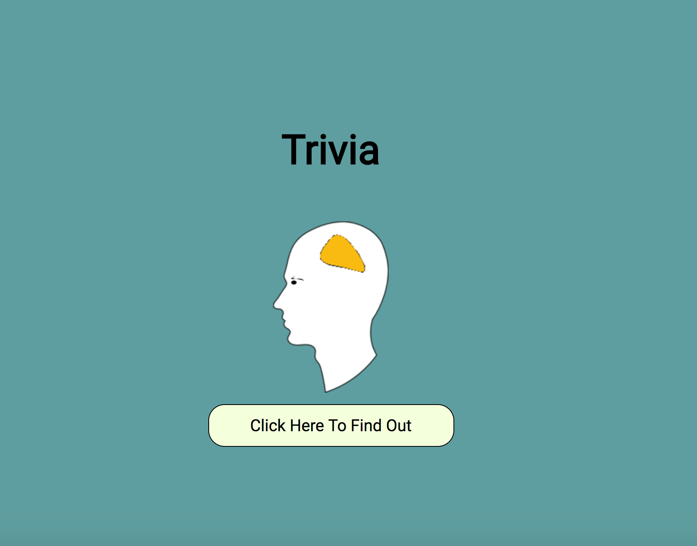

# Trivia

## URL

https://ac5599656.github.io/TriviaGame//

## Screenshots

## Summary

Trivia app allows users to answer question based on universal healthcare. 
Users get 30 seconds to answer each question. Once users answer the question, 
the app responds on users' answers.  If the users answer correctly, they receive
a congragulation and move on to the next question.  If the users answer incorrectly
of does not answer before the time is up, the users will receive a message with the 
correct answer.

## More Description
The problem with the app was the next question happens before users can answer.  To correct the situation,
the next function was called inside the submit function and setTimeout to use delay the next function.

## Technology Used

HTML/CSS/JavaScript/jQuery